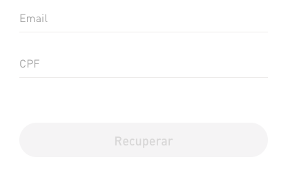
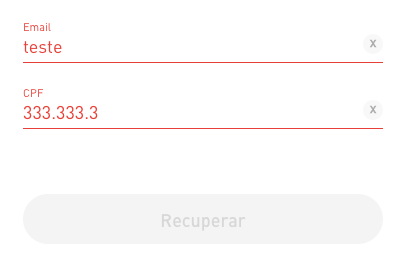
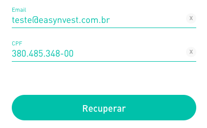

# Teste de Front-end Easynvest
Este teste é apresentado aos candidatos as vagas de desenvolvimento Front-end para avaliar os quesitos técnicos.

### O Desafio

Seu objetivo é criar um simples app que deve conter duas páginas, uma que exibe um formulário dinâmico que renderize seus campos fazendo uma chamada para esta API [link aqui](http://private-da937a-izitest1.apiary-mock.com/fields) e outra que liste os dados salvos pelo formulário dinâmico.

### Pré-requisitos: 
 - Deve ser possível criar, listar e atualizar os dados gerados pelo formulário; 
 - O campo do tipo 'address' deve conter o Autocomplete fornecido pelo Google Maps e renderizar um mapa pelo mesmo;
 - No campo do tipo 'file' deve criar um thumb da imagem que foi carregada;
 - Os inputs de texto e botão devem ter a aparência conforme o guia de estilo abaixo;
 - Fazer a persistência de dados (da forma como preferir);
 - Não é permitido utilizar frameworks ou libs externas;

### Plus:
 - A página ser responsiva;
 - Tela com listagem dos dados salvos;
 - Permitir edição;
 - Uso de pré-processador css;
 - Testes End to End;

### O que esperamos:
 - Testes, no mínimo testes unitários;
 - Padrão de Projeto e boas práticas de Orientação a Objetos;
 - Utilizar Javascript puro;
 - Criar um passo a passo de como rodar sua aplicação [(Sugestão)](https://github.com/wearehive/project-guidelines/blob/master/README.sample.md);
 - Criar uma breve descrição da solução utilizada.

## Guia de estilo

### Input:
 - Cor da fonte sem foco: *#efeeed*.
 - Cor da fonte com foco: *#333333*.
 - Cor da borda: *#EFEEED*.

### Botão Inativo:
 - Cor da fonte sem foco: *#DDDCDC*.
 - Cor de background: *#F6F6F6*.

### Input Inválido:
 - Cor da fonte: *#EB4A46*.
 - Cor da borda: *#EB4A46*.

### Botão Ativo:
 - Cor da fonte com foco: *#FFFFFF*.
 - Cor de background: *#00C8B3*.
 - Opacidade do botão com hover: 70%.

**Criar animação de loading ao clicar no submit*
